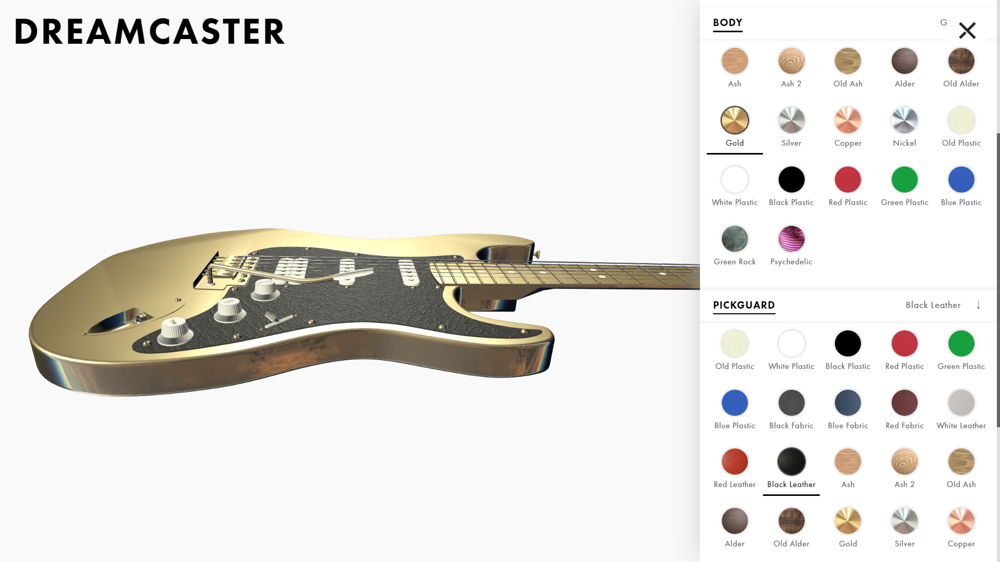

# Report

## Autore
Christian Corrò - 133110

## Descrizione
Il configuratore di prodotto costruito permette di personalizzare nel dettaglio una Dreamcaster, un nuovo modello fantasioso derivato dal modello di una Fender Stratocaster.

## Risultati





## Struttura dei file
```
dreamcaster 
└───css                     
│   │    style.css          - foglio di stile generale
│   │    sidebar.css        - foglio di stile per la sidebar
│   │    main-menu.css      - foglio di stile per il pulsante della sidebar
└───fonts  
│   └─── ...                - font utilizzati 
└───images  
│   └─── icons              - icone del sito             
│   └─── journal            - immagini per il diario              
│   └─── material-previews  - immagini per le preview dei materiali nella sidebar             
│   └─── report             - immagini per la relazione finale
└───js  
│   │    main.js            - script principale          
│   │    sidebar.js         - script per gestire gli eventi della sidebar          
│   │    main-menu.js       - script per gestire l'apertura/chiusura della sidebar          
│   └─── libs               - librerie
└───models                  - modello 3D
│   └─── stratocaster
└───textures                - modello 3D
│   └─── cubemaps           - envMap e irradianceMap
│   └─── materials          - texture per i vari materiali
│   index.html             
```

## Implementazione
La costruzione del configuratore è stata organizzata secondo i seguenti passaggi logici:

1. **Riorganizzazione modello 3D**
    \
    Il modello `.gltf` è stato modificato raggruppando gli oggetti in gruppi corrispondenti alle componenti modificabili della chitarra.
2. **Associazione dei materiali**
    \
    È stato scritto un oggetto `json` in cui si esplicita l'associazione tra le componenti della chitarra e i materiali disponibili per ogni componente.
3. **Costruzione automatica dell'interfaccia**
    \
    Avendo le informazioni sui componenti della chitarra, estratti direttamente dal modello) e le informazioni sui materiali disponibili per ogni componente (contenuti nell'oggetto json) è stata costruita l'interfaccia, la quale, quindi, è interamente procedurale. Per una più semplice manipolazione del DOM è stata utilizzata la libreria *jQuery*.
4. **Costruzione dei materiali**
    \
    Con l'interfaccia operativa è bastato scrivere gli shader per i materiali desiderati e istanziarli secondo le loro caratteristiche pecualiari. Il cambio dei materiali avviene semplicemente riassegnando ricorsivamente a tutte le mesh facenti parte del gruppo selezionato lo `ShaderMaterial`  desiderato.

### Materiali
Per implementare i materiali sono stati scritti tre fragment shaders e un vertex shader. Ad ogni fragment shader sono passate attraverso le uniform le stesse informazioni di illuminazione. Sono state utilizzate tre `PointLight` e un'`AmbientLight`. Posizionate per ricreare e potenziare le sorgenti luminose della enviroment map utilizzata.\
Gli shader sono stati scritti combinando gli shader visti a lezione. In particolare *Glossy Reflection Mapping* *Irradiance Map with diffuse BRDF*, *Normal Mapping:* e *Shading with textures*. Inoltre è stata aggiunta una funzione di Tone Mapping, la stessa utilizzata in Uncharted 2. I materiali realizzati sono materiali plastici, metallici e materiali con texture.\
È disponibile un ulteriore `ShaderMaterial` che, però, non implementa un materiale PBR: è semplicemente il primo shader utilizzato per testare il sistema (vedi l'ultima immagine nei risultati).   

### Software e piattaforme utilizzate
* [**3Ds Max**](https://www.autodesk.com/products/3ds-max/) (licenza studente) per modificare il modello,
* [**CC0 Textures**](https://cc0textures.com/) per le texture PBR gratuite,
* [**Riot** ](https://cc0textures.com/)(Radical Image Optimization Tool) per ridurre il peso delle texture,
* [**Panorama to Cubemap** ](https://cc0textures.com/) per convertire un'immagine panormaica equirettangolare in una cubemap.

## Prestazioni
*  PC CPU i5-7200U 2.5 GHz, RAM 8 GB, Intel HD 620 (integrata)
    * Chrome 88: **60 fps**
    * Edge 88: **60 fps**
    * Firefox 83: **60 fps**
* iPad Air 3
    * Chrome: **55 fps**
    * Safari: **50 fps**
* Samsung Galaxy s8
    * Chrome: **60 fps** 

## Sviluppi futuri
Permettere di aggiungere materiali personalizzati anche con l'upload di texture.

## Crediti
* [Modello Stratocaster](https://evermotion.org/downloads/show/322/fender-stratocaster-3d-model#x) scaricato con licenza CC-BY-NC.
* Cubemap scaricata da [freestocktextures.com](https://freestocktextures.com/)
