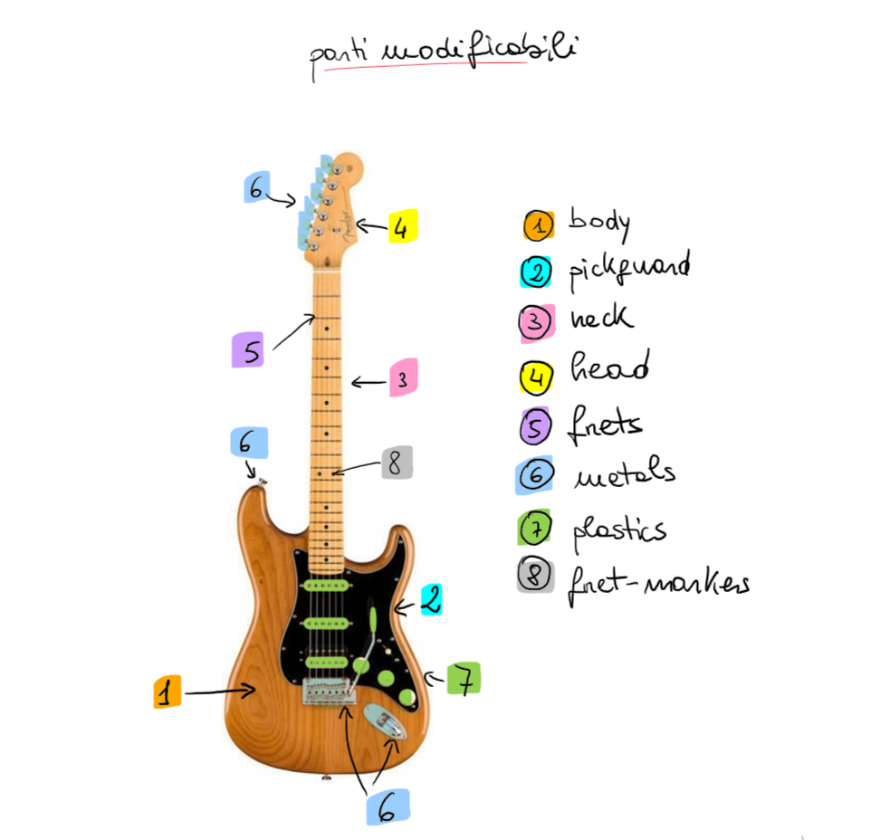
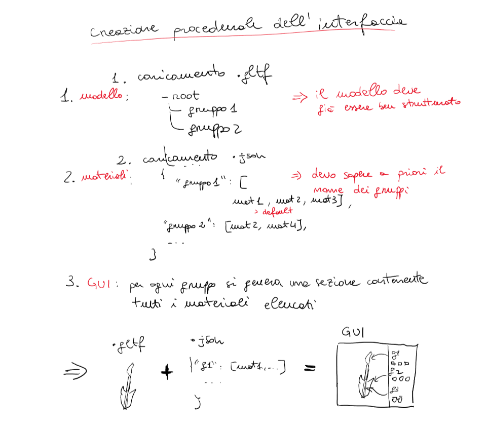
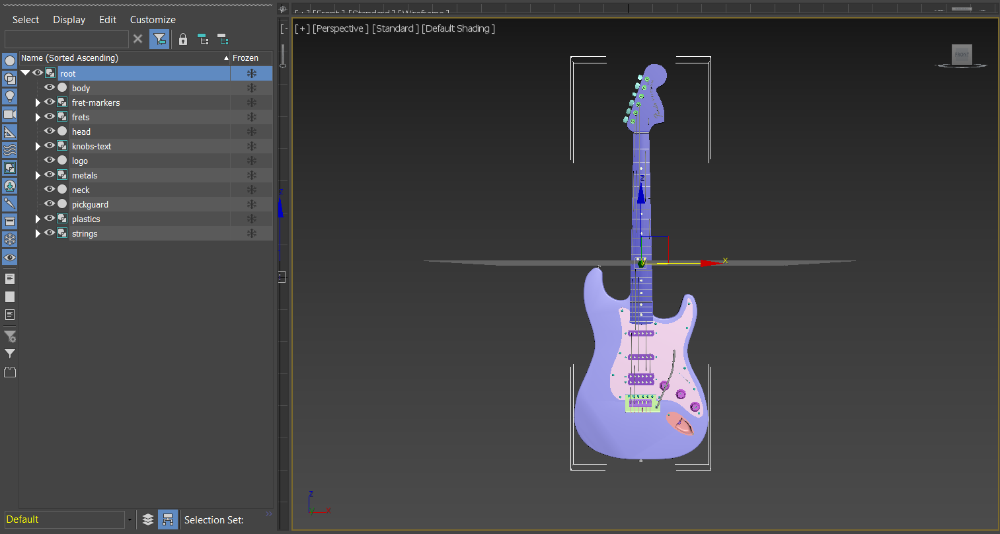
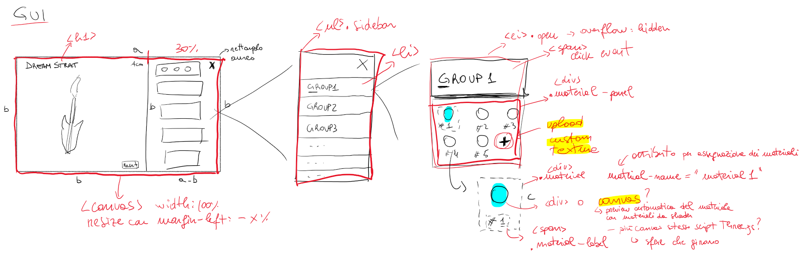
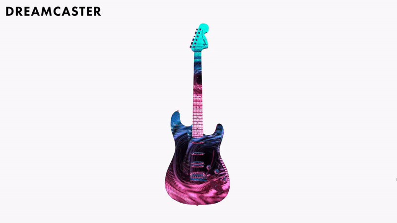
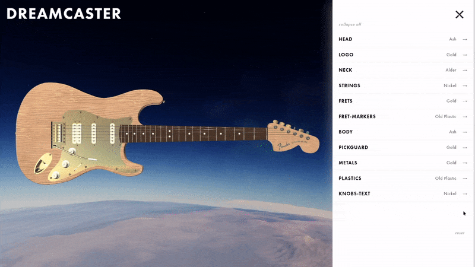

# Journal

## 13 gennaio 2021
* **Idea 1**: __*DREAMCASTER*__
\
L'idea è di poter personalizzare una Stratocaster scegliendo tra dei materiali di default oppure applicare delle texture caricate dall'utente.
\
Mi piace.

    

* **Da fare:**
    - [ ] **Costruire** modello
    - [ ] **Costruire** GUI
    - [ ] **Scrivere gli shader** per i vari materiali

## 14 gennaio 2021
* **Problema**: modelli gratuiti di bassa qualità. Trovato uno, da modificare. Comunque avrei modificato per idea di costruzione interfaccia. Quindi ok.
* **Idea**: l'interfaccia verrà generata in base alle componenti di primo livello del modello e alle informazioni relative ai materiali disponibili per ogni componente o insieme di componenti (gruppo).
    

* **Fatto**:
    - [x] **Costruire** modello

* Raggruppo le componenti modificabili. 
\
Software utilizzati: **3D Max** + **Babylon.js** → *stratocaster.gltf*
Babylon è un plugin per aggirare l'ottusità di Autodesk.

    
 
 * **Da fare:**
    - [ ] **Costruire** GUI
    - [ ] **Scrivere gli shader** per i vari materiali

## 16 gennaio 2021
* **Interfaccia ispirazione**
    \
    https://shop.fender.com/it-IT/mod-shop/stratocaster/0181900706.html
    

* **Progetto interfaccia**

    

 * **Da fare:**
    - [ ] **Costruire** GUI
    - [ ] **Scrivere gli shader** per i vari materiali

## 18 gennaio 2021
* **Problema**: la costruzione dell'interfaccia sta richiedendo più tempo del previsto.
* **Fatto**:
    - [ ] **Costruire** GUI
        - [x] caricato modello
        - [x] scritto funzioni per recuperare tutti gli oggetti facenti parte di un gruppo (ricorsione): (l'idea di raggruppare gli elementi nel modello sembra funzionare molto bene).
        \
        Caricato modello e applicato uno shader carino come material shader. Sembra che il modello abbia problemi con le normali in alcuni punti (vedi manopola per il tremolo, colore unico). Vedremo se darà problemi. 
     
    
    

 * **Da fare:**
    - [ ] **Costruire** GUI
    - [ ] **Scrivere gli shader** per i vari materiali

## 21 gennaio 2021
* **Problema**: come previsto l'applicazione degli shader da problemi su alcuni oggetti del modello. È da giorni che cerco una soluzione. L'usabilità di 3D Max è atroce.
* **Soluzione** 
    È bastato mettere una soglia minima al termine per le normali e tutto funziona a dovere.
    \
    Grazie Internet! 
    https://github.com/mrdoob/three.js/issues/8901

* Trasformazione immagine in cube map con : https://jaxry.github.io/panorama-to-cubemap/

* **Fatto**:
    - [x] **Costruire** GUI
    - [x] **Scrivere gli shader** per i vari materiali

* **Risultato**
    

    L'environment map visibile non mi piace molto. È un po' inelegante e non proprio sensata.

* **Problema**: tra modello e texture si devono caricare circa 12 MB. Richiede un po' di tempo.
* **Soluzione** 
    Aggiungere una pagina di caricamento
    \
     **Da fare:**
    - [ ] **Costruire** loading page

## 24 gennaio 2021
* **Loading page** 

