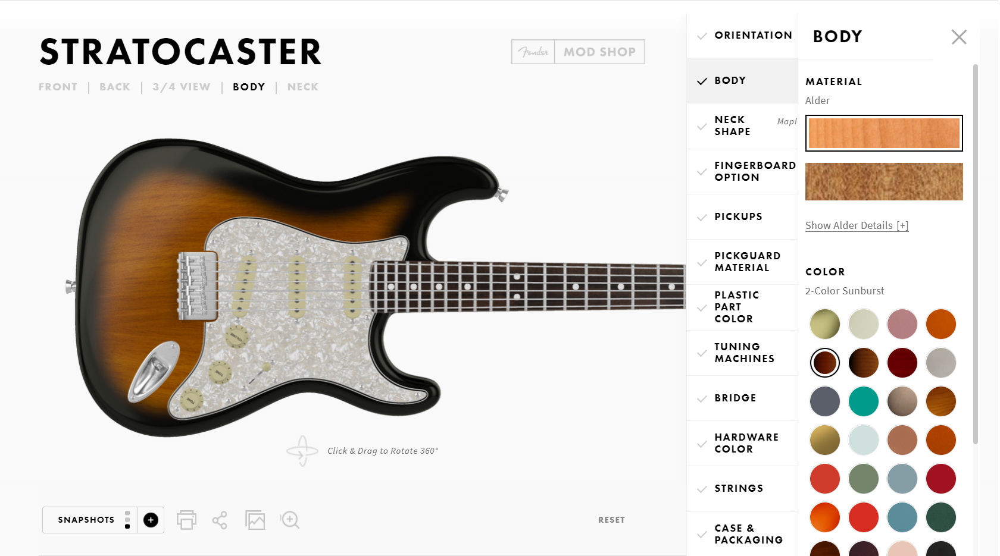

# Journal

## 13 gennaio 2021
* **Idea 1**: __*DREAMCASTER*__
\
L'idea è di poter personalizzare una Stratocaster scegliendo tra dei materiali di default oppure applicare delle texture caricate dall'utente.
Mi piace.

## 14 gennaio 2021

3D Max + Babylon.js -> stratocaster.gltf

\
\
**Interfaccia**
\

